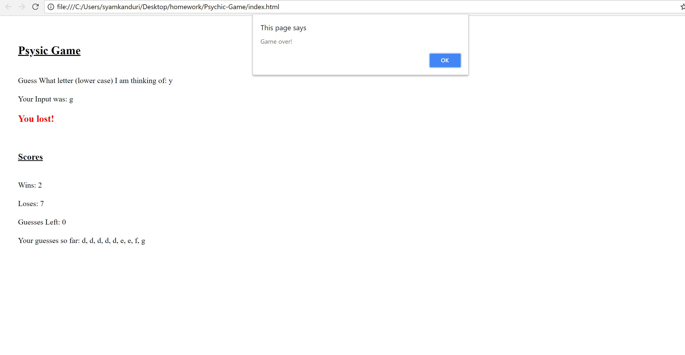

# Psychic Game

<!-- Put the name of the project after the # -->
<!-- the # means h1  -->
# Homework # 3 - Psychic Game

<!-- Put a description of what the project is -->
To develop a small game using javascript, css and html. 

# Link to deployed site
<!-- make a link to the deployed site --> 
<!-- [What the user will see](the link to the deployed site) -->
[my second homework](https://syamkanduri1.github.io/Psychic-Game/)


# Images
<!-- take a picture of the image and add it into the readme  -->
<!--  -->



# technology used
<!-- make a list of technology used -->
<!-- what you used for this web app, like html css -->

html, css, javascript
<!-- 
1. First ordered list item
2. Another item
⋅⋅* Unordered sub-list. 
1. Actual numbers don't matter, just that it's a number
⋅⋅1. Ordered sub-list
4. And another item. 
-->


# code snippets
<!-- put snippets of code inside ``` ``` so it will look like code -->
<!-- if you want to put blockquotes use a > -->

```
            compared computer generated to user entered..and if user wins increment wins counter by 1 and also set winMsg style a bit .... else increment loss counte by 1 and also set message accordingly..
                if(userInput === comInput){
                    wins++;
                    document.getElementById("winMsg").textContent = "You won!";
                    document.getElementById("winMsg").style.color = "blue";
                }
                else {
                    loses++;
                    document.getElementById("winMsg").textContent = "You lost!";
                    document.getElementById("winMsg").style.color = "red";

                }

```


# Learning points
<!-- Learning points where you would write what you thought was helpful -->
Generating random alphabets!

# Author 
Syam Kanduri

# License
Standard MIT License